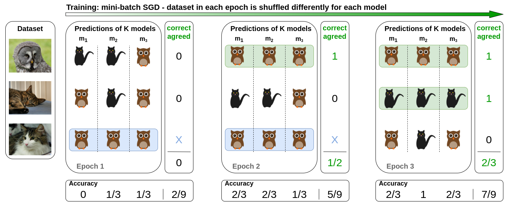

# Code for our paper: When Deep Classifiers Agree: Analyzing Correlations between Learning Order and Image Statistics  

This repository contains PyTorch code for our  [paper](https://arxiv.org/abs/2105.08997):

> **Iuliia Pliushch, Martin Mundt, Nicolas Lupp and Visvanathan Ramesh:
> *"When Deep Classifiers Agree: Analyzing Correlations between Learning Order and Image Statistics"*
> **

### Short summary of the main idea

Despite batch-stochasticity and difference in training details, neural networks preserve the order in which they learn to classify dataset instances. We try to unveil the reason for that by studying correlations of dataset image statistics to agreement, which is the ratio of examples, classified by every network correctly, to examples, classified correctly by at least one network. An exemplary agreement is visualized in Figure 1.

*Figure 1. **Agreement visualization**: During the training process, for each image the classification results are stored, then compared across networks, such that, in addition to **average accurary over networks**, **true positive agreement** can be calculated, which is the ratio of images that all networks classify correctly per epoch to those that at least one network classifies correctly. Images are taken from ImageNet.*

### Requirements

We list our main python packages that are required. In principle our code should work with many different versions. To allow for full reproducibility at later points in time, we also add a pip freeze *requirements.txt* for our machine's exact configuration at the point of writing the paper. Not all of these libraries are needed and the critical libraries that we use are:

* **Python 3 (3.6.9 or 3.8.5)**
* matplotlib 3.3.4
* numpy 1.20.1
* pandas 1.2.2
* Pillow 8.1.0
* scipy 1.6.1
* seaborn 0.11.1
* torch 1.7.1+cu110
* torch-dct 0.1.5
* torchvision 0.8.2+cu110
* tqdm 4.57.0

### Dataset loader modification

The crucial part to establish correlations between image features and the epoch in which this image is classified correctly by the given network(s). Hence, a custom PyTorch ImageFolder class returns not only images and labels, but also image paths, which serve as image indices. During training, for every epoch these indices are stored. The computed dataset metrics are stored with the image paths as keys, so that even after training additional metrics can be computed and correlations visualized.

### Agreement calculation

For each epoch of training a network (and every image), a 0 is stored if the image has been missclassified or 1 else. A possible call for training might be:

> python3 main.py --dataset CIFAR10 --patch-size 32 --batch-size 128 --architecture DenseNet -lr 1e-1 --epochs 60 --num-networks 5 --scheduler CosineAnnealingLR --weight-decay 5e-4 --train-networks

If you have already computed the dataset metrics, add *--visualize-results*. If all your images have the same size, you might also add *--compute-dataset-metrics*. Note that for Pascal VOC, ImageNet and KTH-TIPS2b the batch-size will be set to 1 though, if --compute-dataset-metrics is True.
When training Pascal VOC, do not forget to set --multilabel to True, as well as to change the agreement-type from *single_label* to *exact_match*:

> python3 main.py --dataset VOCDetection --patch-size 224 --batch-size 128 --architecture DenseNet -lr 1e-1 --epochs 150 --num-networks 5 --scheduler StepLR --step-gamma 0.2 --step-size 50 --weight-decay 5e-4 --multilabel --agreement-type exact_match --train-networks --visualize-results

You might also adjust the *script_networks.sh* to adjust the training routine. For CIFAR10, you can use *script_labels.sh* to randomize-labels during training.

### Dataset metrics computation

If you want to compute the selected dataset metrics, you can execute the *main.py* using the argument --compute-dataset-metrics. For KTH-TIPS2b and Pascal VOC, the batch-size will be set automatically to 1 for computation of the metrics on original images (of different sizes). For ImageNet, resize to a chosen patch-size is used instead with batch-size 1 (to enhance the computation).

Several dataset metrics can be computed:
- **mean image entropy**: A window of a certain size (10) is slided over the image, image entropy is computed for that window, as well as average calculated over local window entropies, similar to <https://github.com/TamojitSaha/Image_Entropy>.
- **percentage of relevant DCT coefficients**: The file *lib/helpers/dct.py* contains a copy of the code to compute DCT-coefficients from <https://github.com/zh217/torch-dct/blob/98c196dc0b62705068c13785e8681fb9bd076173/torch_dct/_dct.py#L32>, distributed under the MIT license, which can be found here: <https://github.com/zh217/torch-dct/blob/98c196dc0b62705068c13785e8681fb9bd076173/LICENSE>. The relevant coefficients are chosen according to: <https://de.mathworks.com/help/signal/ref/dct.html>
- **segment count**: Please download and unzip into the *metrics*-folder the original code from  <http://cs.brown.edu/people/pfelzens/segment/>
- **sum of edge strenghts**: For the computation of edge strengths, you would need *MATLAB* version **R2014b**. Please download into the *metrics* folder the code from <https://github.com/phillipi/crisp-boundaries>. A small modification might be needed for execution (of changing a relative cache path to absolute in *getLocalPairs.m*). Use the script *find_all_boundaries.m* in *metrics* to compute sum of edge strengths for a dataset, in which images have been stored into train/test folders (which class-subfolders). Starting MATLAB in the folder with the script, a sample call might be: *find_all_boundaries('../datasets/CIFAR10_indx', 'CIFAR10', '.jpg', 'speedy', false, false);*. If you want to visualize edge strengths for a set of images, use the *find_all_boundaries_folder.m* script.

- **predictive entropy based on soft labels for CIFAR10 testset**: The soft labels are automatically downloaded in *lib/dataset_metrics.py* from <https://github.com/jcpeterson/cifar-10h/blob/master/data/cifar10h-probs.npy>.
- **visual search difficulty for VOC Detection (2012)**:  The search difficulty scores are automatically downloaded in *lib/dataset_metrics.py* from <https://image-difficulty.herokuapp.com/Visual_Search_Difficulty_v1.0.zip>

### Visualization of results

The results are stored in *results/dataset/architecture/date-time*. To visualize them, as well as the correlations, set the dataset, architecture and save-dir (subdirectory, in which results are saved, which is date-time):

> python3 main.py --dataset ImageNet --architecture DenseNet --save-dir replace_path_here --visualize-results
